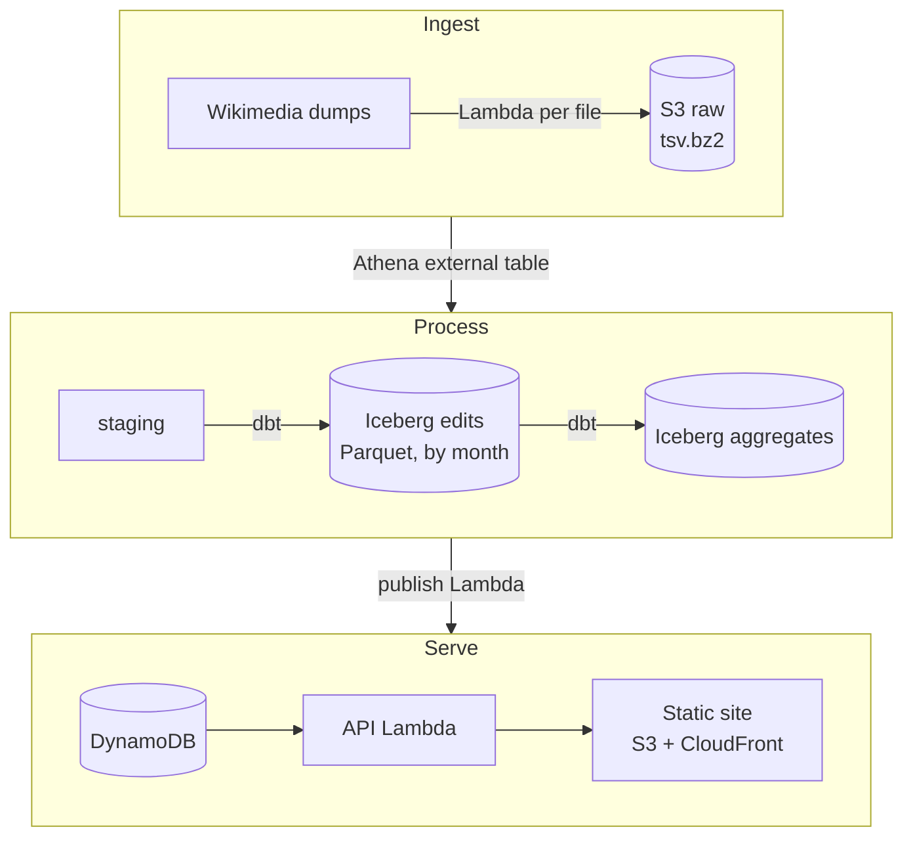

**What it is:** a site showing what happened on English Wikipedia in 2025 - most edited pages, biggest changes, most fought-over pages - built as a batch lakehouse on AWS.

### The data

Source: MediaWiki History dumps, `dumps.wikimedia.org/other/mediawiki_history/<snapshot>/enwiki/` (checked 2026-10-02).

- One row per event; I want the revision events (`event_entity = revision`, `event_type = create`), i.e. one row per edit
- 78 tab-separated fields, no header row, bzip2 compressed, nulls as empty fields, tabs/newlines backslash-escaped (column order: Wikitech page "Mediawiki history dumps")
- Checked on a sample (2026-10-02): timestamps as `2025-01-01 00:00:00.0`, booleans as `true`/`false`, arrays comma-joined (`autoreviewer,extendedconfirmed`); in the first 3,000 rows about 72% were revision events, the rest page and user events
- Each snapshot is the full history since 2001, rebuilt monthly (released around the end of the first week); only the last two snapshots are kept
- File names carry the snapshot as a prefix: `2026-08.enwiki.2025-01.tsv.bz2`
- Scope: the twelve 2025 files, 510-680 MB each, 6.7 GB compressed in total

Fields I need:

| Field | Use |
|---|---|
| `event_timestamp` | When; partition key |
| `revision_id`, `page_id`, `page_title`, `page_namespace` | What was edited; namespace 0 = articles |
| `event_user_text`, `event_user_is_anonymous`, `event_user_is_bot_by` | Who; bot versus human |
| `revision_text_bytes`, `revision_text_bytes_diff` | Size of the change |
| `revision_is_identity_reverted`, `revision_is_identity_revert`, `revision_seconds_to_identity_revert` | Filter vandalism; find edit wars |
| `revision_tags`, `event_comment` | Optional colour |

### Design

**1. Ingest (dumps -> S3 raw)**
- Step Functions workflow: find the latest snapshot folder -> list the 2025 files -> one Lambda per file, streaming the download straight into an S3 multipart upload
- Low concurrency (2) to be polite to the dump servers
- Lands at `raw/mediawiki_history/snapshot=2026-08/wiki=enwiki/`, untouched
- Idempotent: skip a file that already exists at the same size
- Keep the raw copy - the snapshot disappears from Wikimedia after two months

**2. Process (raw -> edits table)**
- Athena external table over the raw files, all 78 columns as strings (Athena reads bzip2 text directly)
- dbt model selects revision events, casts types, keeps the ~15 fields above, writes an Iceberg table `edits` partitioned by month of `event_timestamp`
- dbt tests: `revision_id` unique and not null, timestamps inside 2025, row counts per month within an expected range

**3. Aggregate (edits -> aggregates)**
- `page_daily`: edits, distinct editors, bytes added, bytes removed, reverts - per page per day
- `top_pages`: top 100 per day and per month by edits, by editors, by net bytes, by reverts
- `biggest_edits`: largest single additions and removals, excluding reverted edits and reverts
- `site_daily`: total edits, bot share, anonymous share, revert rate
- `editor_monthly`: edits and net bytes per editor

**4. Publish (aggregates -> DynamoDB)**
- Lambda runs Athena queries over the aggregates and batch-writes the results
- One item per leaderboard: `PK = TOP#<metric>#<period>`, holding the whole top-100 list
- One item per page per month for the time series: `PK = PAGE#<page_id>`, `SK = <yyyy-mm>`, holding a daily array - only for pages that appear in a leaderboard
- Each item carries the snapshot it was built from, so the site can show how fresh the data is

**5. Serve**
- One Lambda behind a function URL: `/top?metric=&period=`, `/page/{id}`, `/summary`
- Static frontend on S3 + CloudFront

### Tech

| Layer | Choice |
|---|---|
| Infrastructure | CDK (TypeScript), deployed by GitHub Actions |
| Scheduling/orchestration | EventBridge + Step Functions |
| Ingest | Lambda (Python) |
| Storage | S3; Iceberg tables in the Glue catalog |
| Query engine | Athena |
| Transformations and tests | dbt with the Athena adapter, run from GitHub Actions |
| Serving store | DynamoDB |
| API | Lambda function URL |
| Website | Static site on S3 + CloudFront |

### Estimates

Data volume (row and size figures are my estimates until the first file is loaded):

| Thing | Estimate |
|---|---|
| Raw download | 6.7 GB compressed (measured) |
| Edits in 2025 | 60-70 million rows |
| Uncompressed | 40-55 GB |
| `edits` as Parquet, ~15 columns | 4-8 GB |
| Aggregates | Under 1 GB |
| DynamoDB items | About 2,000 leaderboards plus up to 240,000 page-month items |

Monthly cost (prices from memory - check before deploying):

| Item | Cost |
|---|---|
| S3, about 13 GB raw + Parquet | $0.30 |
| Athena, at $5 per TB scanned | Under $0.10 |
| Lambda, Step Functions, DynamoDB, CloudFront, Glue catalog | $0 within free allowances |
| **Total** | **About $0.40 a month** |

- One-off backfill: about $0.03 of Athena to read the 6.7 GB once
- DynamoDB load: use provisioned capacity inside the free 25 writes/second (about 3 hours for 240,000 items) rather than on-demand
- Moving raw files to an archive storage class would roughly halve the S3 line

### Build order

1. CDK skeleton, GitHub Actions deploy, billing alarm
2. Ingest one file by hand, then the workflow for all twelve
3. External table + `edits` model for one month; check the row and size estimates; then the full year
4. Aggregate models and tests
5. Publish Lambda and DynamoDB table
6. API and website

### Later

- Monthly refresh from each new snapshot (revert flags change after the fact - reload or merge?)
- Live edits from EventStreams via an hourly catch-up Lambda, stitched onto the backfill
- Local Kafka + Flink + ClickHouse version of the same aggregates
- Join pageview dumps: heavily edited versus heavily read

## Open questions

- Does Athena's text reader handle the backslash-escaped tabs and the comma-encoded array fields cleanly, or does the conversion need a Lambda/DuckDB step instead?
- Can a single Lambda download a 680 MB file from the dump servers inside 15 minutes? Depends on their throttling - measure on the first file.
- Orchestration: Step Functions keeps everything serverless and free, but Airflow/Dagster is what job specs name. Run one locally later for comparison?
- Articles only (namespace 0), or include talk pages and the rest?
- Include bots in the leaderboards, or show them separately?

## Where it stands

In research. Plan written for a 2025 English Wikipedia edit analytics site on AWS at about $0.40 a month. Next step: settle the open questions above, starting with ingesting one month's file by hand to check the Athena parsing, download time and size estimates.